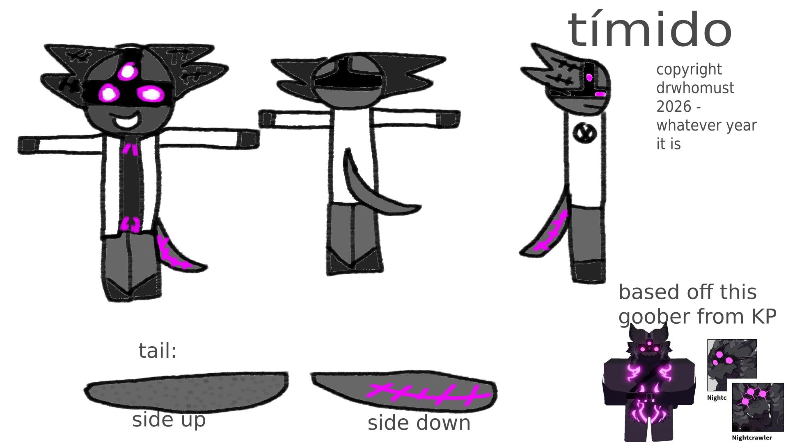

Timido is a [nightcrawler](https://kaijuparadiseofficial.miraheze.org/wiki/Nightcrawler) and unlike most
of the other ones they are very playful and loves to explore and adventure out. They don't like to use
their abitlies as a nightcrawler because they don't want to harm anyone because they hate violence and perfer
peace. The only time they will hurt someone is if it puts their or somebody's life in danger. They also very smart
with electronics knowing how to make circuits and understanding how to use a computer and even knowing how to
program.

They don't have good social skills and are very bad at understanding social norms and also talking with other
people (both rays and humans) and most of time hides away from them. They do have a few friends however who
bring them comfort

## other info

Name: Timido

Ray: [Nightcrawler](https://kaijuparadiseofficial.miraheze.org/wiki/Nightcrawler)

Personaillty: Playful

Gender: [Non-Binary](https://en.wikipedia.org/wiki/Non-binary)
